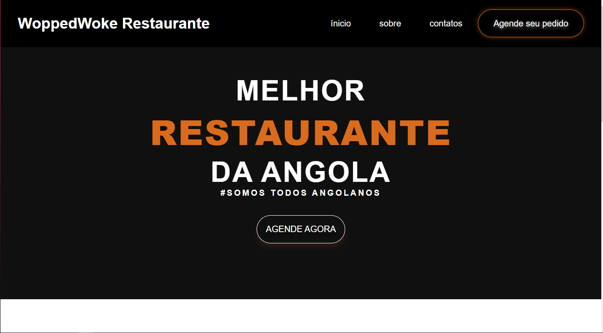

# site restaurante angolano
<h1>Parte 2/3 projeto senai: desenvolvimento de site</h1>

pov: sem o uso de javascript

<a style="font-size: 40px;" href="https://woppedwoke.github.io/site_restaurante/">Usar</a>
 

# Preview

# Tecnologias usadas
<ul>
  <li>HTML</li>
  <li>CSS</li>
</ul>

# what the fuck is this?

website for selling food located in the country angola, why specifically angola?

because it is a people that deserves due respect for several aspects

